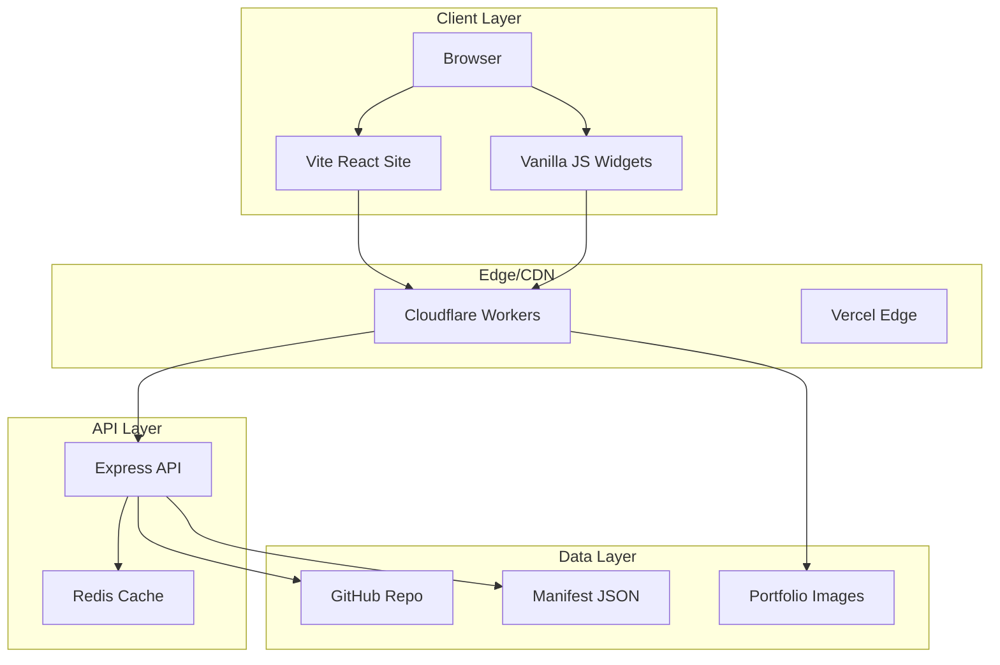

# README Missing Sections - Templates

Copy these templates into your root `README.md` to fill the gaps identified in the audit.

---

## 1. Security Policy Reference

```markdown
## 🔒 Security

### Reporting Vulnerabilities

If you discover a security vulnerability, please:

1. **Do NOT** open a public issue
2. Email security@mcc-cal.com with details
3. Allow 48 hours for initial response
4. Coordinate disclosure timeline

### Security Measures

| Measure | Status |
|---------|--------|
| Dependency scanning | ✅ `npm audit` in CI |
| Secret detection | ✅ GitLeaks pre-commit hook |
| HTTPS enforcement | ✅ All production traffic |
| CSP headers | ✅ Configured in Vercel |
| Rate limiting | ✅ API: 100 req/min |

### Secrets Management

- Environment variables in `.env` (never committed)
- API keys stored in GitHub Secrets
- Cloudflare Workers use encrypted env vars
- See [AUTH-SETUP-GUIDE.md](docs/integrations/AUTH-SETUP-GUIDE.md) for setup
```

---

## 2. Changelog Link

```markdown
## 📋 Changelog

### Recent Highlights

**v2.5.3** (Dec 2025)
- ✅ Completed 2026 repository cleanup (39 → 29 root files)
- ✅ Fixed all security vulnerabilities (0 remaining)
- ✅ Updated 7 major dependencies
- ✅ Consolidated documentation structure

### Full History

See [CHANGELOG.md](CHANGELOG.md) for complete version history including:
- All 380 widget versions
- API deployment milestones
- Infrastructure changes
- Breaking changes and migrations

### Versioning Strategy

- **Widgets**: Semantic versioning (v1.2.3)
- **API**: Date-based (2025.12.31)
- **Site**: Calendar versioning (v2.5.3)
```

---

## 3. Architecture Diagram

```markdown
## 🏗️ Architecture

### System Overview



### Component Details

| Component | Technology | Purpose |
|-----------|------------|---------|
| **Vite Site** | React 18 + TypeScript | Main website (mcc-cal-vite) |
| **Widgets** | Vanilla JS | Embeddable portfolio displays |
| **API** | Express 5 + Redis | Portfolio data & caching |
| **CDN** | Cloudflare Workers | Global edge caching |
| **Images** | GitHub + jsDelivr | Portfolio image hosting |
| **CI/CD** | GitHub Actions | 35 automated workflows |

### Data Flow

1. **Image Upload** → GitHub → Manifest Generation → CDN Cache
2. **Widget Request** → Cloudflare → Cache Hit/Miss → API (if needed)
3. **Site Build** → Vite → Vercel Deployment

See [PROJECT-STRUCTURE.md](docs/standards/PROJECT-STRUCTURE.md) for details.
```

---

## 4. Performance Benchmarks

```markdown
## ⚡ Performance

### Lighthouse Scores (Production)

| Metric | Score | Target |
|--------|-------|--------|
| Performance | 95+ | 90+ |
| Accessibility | 100 | 100 |
| Best Practices | 100 | 100 |
| SEO | 100 | 100 |

### Core Web Vitals

| Metric | Value | Status |
|--------|-------|--------|
| LCP (Largest Contentful Paint) | ~1.2s | ✅ Good |
| FID (First Input Delay) | <50ms | ✅ Good |
| CLS (Cumulative Layout Shift) | <0.1 | ✅ Good |
| TTFB (Time to First Byte) | ~150ms | ✅ Good |

### Bundle Analysis

```
Vite Site (mcc-cal-vite):
├── main.js          ~85KB (gzipped)
├── vendor.js       ~125KB (React, Router, Query)
├── styles.css       ~15KB
└── Total           ~225KB
```

### Image Optimization

- **Format**: WebP with JPEG fallback
- **Quality**: 80% (visually lossless)
- **Max Size**: 3840x2160 (4K)
- **Lazy Loading**: Intersection Observer
- **CDN**: jsDelivr + Cloudflare

### API Performance

| Endpoint | Avg Response | Cache Hit |
|----------|--------------|-----------|
| `/api/portfolio/concert` | 45ms | 85% |
| `/api/portfolio/nature` | 38ms | 90% |
| `/api/health` | 12ms | 0% |

### CI/CD Performance

- **Build Time**: ~45 seconds (Vite site)
- **Test Suite**: ~30 seconds (Playwright)
- **Deploy Time**: ~60 seconds (Vercel)

See [lighthouse-widgets.yml](.github/workflows/lighthouse-widgets.yml) for automated testing.
```

---

## 5. Browser Support Matrix

```markdown
## 🌐 Browser Support

### Officially Supported

| Browser | Version | Status | Notes |
|---------|---------|--------|-------|
| Chrome | Last 3 | ✅ Full | Primary development |
| Firefox | Last 3 | ✅ Full | Tested in CI |
| Safari | 15+ | ✅ Full | macOS + iOS |
| Edge | Last 3 | ✅ Full | Chromium-based |
| Mobile Safari | 15+ | ✅ Full | iOS 15+ required |
| Chrome Android | Last 3 | ✅ Full | Primary mobile |

### Limited Support

| Browser | Version | Status | Notes |
|---------|---------|--------|-------|
| Firefox ESR | 115+ | ⚠️ Partial | Widgets only |
| Safari 14 | 14.x | ⚠️ Partial | No backdrop-filter |
| IE 11 | - | ❌ Not supported | Upgrade required |

### Feature Detection

We use progressive enhancement:

```javascript
// WebP support detection
const supportsWebP = document.createElement('canvas')
  .toDataURL('image/webp')
  .indexOf('data:image/webp') === 0;

// Intersection Observer (lazy loading)
if ('IntersectionObserver' in window) {
  // Native lazy loading
} else {
  // Fallback to eager loading
}

// CSS.supports for advanced features
if (CSS.supports('backdrop-filter', 'blur(10px)')) {
  // Glass morphism effects
}
```

### Polyfills

Only loaded when needed (dynamic import):

```javascript
// For older browsers
if (!Array.prototype.at) {
  await import('./polyfills/array-at.js');
}
```

### Testing Strategy

- **Primary**: Chrome (Playwright tests)
- **Secondary**: Firefox (manual + CI smoke)
- **Mobile**: Chrome Android + Mobile Safari (manual)

### Known Limitations

- **Safari 14**: No backdrop-filter (navigation uses solid background)
- **Firefox ESR**: Limited widget interactivity
- **No IE Support**: IE 11 users see upgrade message

See [a11y-axe-firefox.yml](.github/workflows/a11y-axe-firefox.yml) for accessibility testing.
```

---

## Usage Instructions

1. Copy the sections you need from above
2. Paste into `README.md` in appropriate order
3. Update placeholders (email, URLs, scores) with real values
4. Remove any sections that don't apply

### Suggested README Structure

```
1. Project Overview
2. Quick Start
3. Architecture ← NEW
4. Browser Support ← NEW
5. Performance ← NEW
6. Security ← NEW
7. Project Structure
8. Widget Catalog
9. API Documentation
10. Available Scripts
11. Changelog ← NEW (or link in footer)
12. Contributing
```
