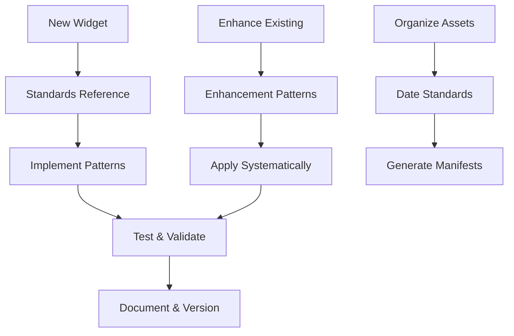

# McCal Media Site Standards (Vite-Focused)

This document contains the current standards, conventions, and best practices for the Vite-based production site.

## Table of Contents

- [McCal Media Site Standards (Vite-Focused)](#mccal-media-site-standards-vite-focused)
  - [Table of Contents](#table-of-contents)
  - [Workspace \& Repository Standards](#workspace--repository-standards)
  - [Performance \& Accessibility](#performance--accessibility)
  - [SEO Standards](#seo-standards)
  - [Deployment \& Build](#deployment--build)
  - [Vite Site Standards (2026+)](#vite-site-standards-2026)
  - [New Vite Site Standards](#new-vite-site-standards)
  - [Quick Start Guide](#quick-start-guide)
    - [For New Widget Development](#for-new-widget-development)
    - [For Widget Enhancement](#for-widget-enhancement)
    - [For Asset Organization](#for-asset-organization)
  - [Development Workflow](#development-workflow)

---

## Workspace & Repository Standards
- [workspace-organization.md](./workspace-organization.md): Folder structure, archival, validation, and preflight/afterflight checklists.
- [date-naming.md](./date-naming.md): Naming conventions for images and manifests.
- [versioning.md](./versioning.md): Versioning guidelines for site and assets.

## Performance & Accessibility
- [ui-patterns.md](./ui-patterns.md): UI and accessibility patterns for the Vite site.
- [enhancements.md](./enhancements.md): Modern enhancement patterns for Vite.

## SEO Standards
- [image-seo-standards.md](./image-seo-standards.md): Image SEO for Vite (to be expanded).
- [seo-starter-guide.md](./seo-starter-guide.md): SEO starter guide for Vite (to be expanded).
- [seo-testing-guide.md](./seo-testing-guide.md): SEO validation for Vite (to be expanded).

## Deployment & Build
- [deployment/DEPLOYMENT.md](../deployment/DEPLOYMENT.md): Main deployment documentation.
- [deployment/DEPLOY-CHEATSHEET.md](../deployment/DEPLOY-CHEATSHEET.md): Quick deployment reference.
- [deployment/PACKAGE-DEPLOYMENT.md](../deployment/PACKAGE-DEPLOYMENT.md): Package-based deployment.
- [deployment/SETUP-GITHUB-HOSTING.md](../deployment/SETUP-GITHUB-HOSTING.md): GitHub Pages hosting setup.

---

## Vite Site Standards (2026+)

## New Vite Site Standards

- [UI Patterns](./ui-patterns.md)
- [Enhancements](./enhancements.md)
- [Debugging](./debugging.md)
- [Changelog Standard](./changelog-standard.md)

---

## Legacy Widget/Squarespace Docs

For all legacy widget and Squarespace documentation, see [legacy/README.md](./legacy/README.md). These are retained for migration/reference only. All new work should follow the Vite standards above.

---
## Quick Start Guide

### For New Widget Development
1. Read: [widget-reference.md](./widget-reference.md) (quick checklist)
2. Reference: [widget-standards.md](./widget-standards.md) (detailed patterns)
3. Follow: Repository versioning from [versioning.md](./versioning.md)

### For Widget Enhancement  
1. Review: [widget-standards.md](./widget-standards.md) (proven improvements)
2. Apply: [widget-development.md](./widget-development.md) (systematic process)
3. Test: Validate with existing standards

### For Asset Organization
1. Follow: [date-naming.md](./date-naming.md) (photo naming)
2. Version: Use [versioning.md](./versioning.md) guidelines

---

## Development Workflow

---

*These standards ensure consistency, maintainability, and quality across all McCal Media widgets and assets.*