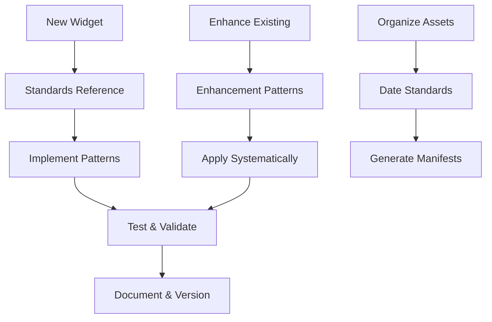

# Standards Documentation

Guidelines, conventions, and best practices for the McCal Media workspace.

## Widget Development Standards

### 📋 **widget-reference.md** ⭐ **START HERE**
Quick reference checklist and common patterns for widget development. Essential for daily development.

### ⚡ **performance-standards.md** ⭐ **PERFORMANCE FIRST**
Lighthouse optimization guide using Concert Portfolio v4.6 as case study. **Required reading for all widget development.**

### 📖 **widget-standards.md**
Comprehensive widget standards documentation covering architecture, design patterns, performance, and accessibility requirements.

### � **widget-standards.md**
Comprehensive widget standards, proven UX and technical improvements, and best practices for all widgets. All enhancement patterns are now integrated here.

### 🔄 **widget-development.md**
Systematic methodology for applying enhancement patterns across widgets with implementation checklists and quality standards.

### 🎨 **theming-for-widgets.md**
Practical guidance for implementing light/dark theming across playgrounds and production widgets (tokens, data-theme, THEME_KEY, propagation, and testing).

### ✅ Lessons Learned (Nov 2025)
Key theming and visibility hardening patterns (now required for new widgets and major updates):

- Container-scoped theming: Set `data-theme` on the widget root (not `<html>`) to avoid Squarespace global CSS collisions.
- “Blinding Mode” naming: Present the bright theme as “Blinding Mode” in UI while keeping CSS selectors targeting `[data-theme="light"]` for compatibility.
- Toggle label convention: Show the action, not state (e.g., in dark mode the button says “Blinding Mode”; in light mode it says “Dark Mode”).
- Safe color tokens: Define and apply `--body-safe` and `--link-safe` for text/links to guarantee contrast regardless of host theme.
- Heading resets: Force `h1/h2/h3` inside the widget to neutralize host gradient/transparent text with `-webkit-text-fill-color: currentColor`, `background: none !important`, and `mix-blend-mode: normal !important`.
- Haze overlays (bright theme): Keep overlays behind content (`::before`, `z-index: -1`), use gentle opacity/blur, and never rely on transparent text — preserve AA/AAA contrast.

See the “Theming & Visibility Hardening (2025-11-12)” section in `widget-standards.md` for full guidance and example code.

## Repository Standards

### �️ **workspace-organization.md**
**Single source of truth for scripts folder structure, archival, workspace validation, and preflight/afterflight checklists.**
All contributors must follow this document for any changes to scripts or workspace organization.

### 📅 **date-naming.md**
Naming conventions for photo organization and date parsing in manifest generation.

### 🏷️ **versioning.md**
Semantic versioning guidelines for widgets, manifests, and repository components.

---

## Quick Start Guide

### For New Widget Development
1. **Read**: `widget-reference.md` (quick checklist)
2. **Reference**: `widget-standards.md` (detailed patterns)
3. **Follow**: Repository versioning from `versioning.md`

### For Widget Enhancement  
1. **Review**: `widget-standards.md` (proven improvements)
2. **Apply**: `widget-development.md` (systematic process)
3. **Test**: Validate with existing standards

### For Asset Organization
1. **Follow**: `date-naming.md` (photo naming)
2. **Version**: Use `versioning.md` guidelines

---

## Development Workflow

---

*These standards ensure consistency, maintainability, and quality across all McCal Media widgets and assets.*