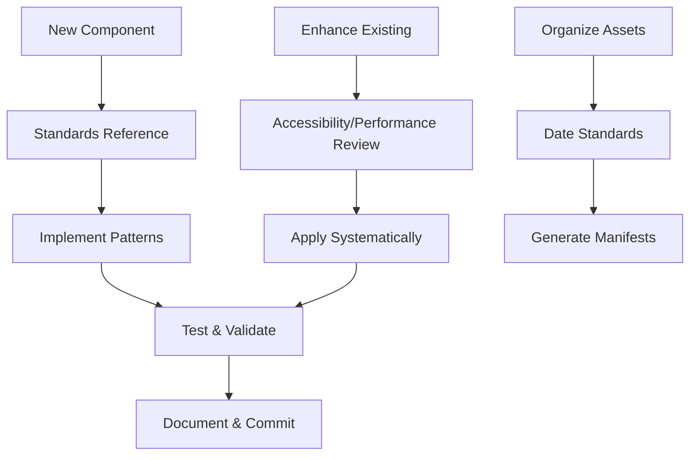

# McCal Media Site Standards (Vite-Focused)

This document contains the current standards, conventions, and best practices for the Vite-based production site.

## Table of Contents

- [McCal Media Site Standards (Vite-Focused)](#mccal-media-site-standards-vite-focused)
  - [Table of Contents](#table-of-contents)
  - [Workspace & Repository Standards](#workspace--repository-standards)
  - [Performance & Accessibility](#performance--accessibility)
  - [SEO Standards](#seo-standards)
  - [Migration & Reference](#migration--reference)
  - [Deployment & Build](#deployment--build)
  - [Quick Start Guide](#quick-start-guide)
    - [For New Component Development](#for-new-component-development)
    - [For Component Enhancement](#for-component-enhancement)
    - [For Asset Organization](#for-asset-organization)
  - [Development Workflow](#development-workflow)

---

## Workspace & Repository Standards
- [workspace-organization.md](./workspace-organization.md): Folder structure, archival, validation, and preflight/afterflight checklists.
- [date-naming.md](./date-naming.md): Naming conventions for images and manifests.
- [scripts-folder-organization.md](./scripts-folder-organization.md): Scripts directory structure.

## Performance & Accessibility
- [ui-patterns.md](./ui-patterns.md): UI and accessibility patterns for the Vite site.
- [accessibility-patterns.md](./accessibility-patterns.md): Detailed accessibility guidelines.
- [performance-standards.md](./performance-standards.md): Performance optimization guidelines.

## SEO Standards
- [image-seo-standards.md](./image-seo-standards.md): Image SEO for Vite.
- [seo-starter-guide.md](./seo-starter-guide.md): SEO starter guide for Vite.
- [seo-testing-guide.md](./seo-testing-guide.md): SEO validation for Vite.

## Migration & Reference
- [widget-to-vite.md](./widget-to-vite.md): Migration guide from legacy widgets to Vite.
- **Legacy Standards**: Archived in `archive/legacy-standards/` for reference only.

## Deployment & Build
- [deployment/DEPLOYMENT.md](../deployment/DEPLOYMENT.md): Main deployment documentation.
- [deployment/DEPLOY-CHEATSHEET.md](../deployment/DEPLOY-CHEATSHEET.md): Quick deployment reference.
- [deployment/PACKAGE-DEPLOYMENT.md](../deployment/PACKAGE-DEPLOYMENT.md): Package-based deployment.
- [deployment/SETUP-GITHUB-HOSTING.md](../deployment/SETUP-GITHUB-HOSTING.md): GitHub Pages hosting setup.

---

## Quick Start Guide

### For New Component Development
1. Reference: [ui-patterns.md](./ui-patterns.md) for UI guidelines
2. Follow: [workspace-organization.md](./workspace-organization.md) for structure
3. Test: Validate with [performance-standards.md](./performance-standards.md)

### For Component Enhancement
1. Review: [accessibility-patterns.md](./accessibility-patterns.md) for improvements
2. Apply: Systematic process following existing patterns
3. Test: Validate with existing standards

### For Asset Organization
1. Follow: [date-naming.md](./date-naming.md) (photo naming)
2. Review: [image-seo-standards.md](./image-seo-standards.md) for optimization

---

## Development Workflow

---

*These standards ensure consistency, maintainability, and quality across all McCal Media widgets and assets.*