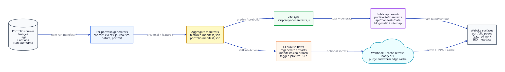

# Portfolio Manifest Pipeline

This workflow explains how portfolio source files become the manifests and static assets used by the public Vite site.



Diagram source: `docs/diagrams/portfolio-manifest-pipeline.d2`

## Pipeline

1. Portfolio sources live under `src/images/Portfolios/**`.
   - Images, folder structure, tags, captions, and date metadata are the authored inputs.
2. Per-portfolio generators produce category manifests.
   - Examples: `manifest:concert`, `manifest:events`, `manifest:journalism`, `manifest:nature`, and `manifest:portrait`.
3. Aggregate manifests collect portfolio entries.
   - `featured-manifest.json` supports featured work.
   - `portfolio-manifest.json` supports cross-portfolio discovery.
4. The Vite app syncs runtime copies.
   - `sites/mcc-cal-vite/scripts/sync-manifests.js` copies manifests into `public-vite/manifests` and `api/manifests/data`.
   - The same sync flow refreshes blog static content and the sitemap when build/dev scripts run.
5. CI can publish manifest outputs.
   - Manifest workflows can regenerate artifacts, push the `manifests-cdn` branch, tag stable jsDelivr URLs, and notify webhooks when secrets are configured.
6. Webhook and cache refresh steps are optional.
   - Missing webhook secrets should skip notification safely.
   - Configured webhooks can purge and warm API or edge caches after manifest updates.

## Regenerating Diagrams

D2 is a local authoring tool for these diagrams. The repo consumes checked-in SVGs and does not require D2 during build or CI.

```bash
d2 --theme=0 --pad=48 --scale=1 docs/diagrams/portfolio-manifest-pipeline.d2 docs/diagrams/portfolio-manifest-pipeline.svg
d2 --theme=200 --pad=48 --scale=1 docs/diagrams/roadmap-platform-evolution.d2 sites/mcc-cal-vite/public-vite/images/diagrams/roadmap-platform-evolution.svg
```

Edit the `.d2` source first, then regenerate the matching SVG.

## Related Docs

- [CDN-hosted manifests](../manifest-cdn.md)
- [Portfolio image import](./portfolio-image-import.md)
- [Content publishing workflow](./content-publishing.md)
