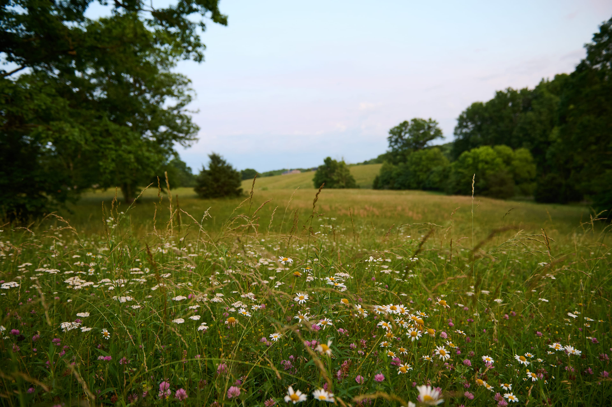
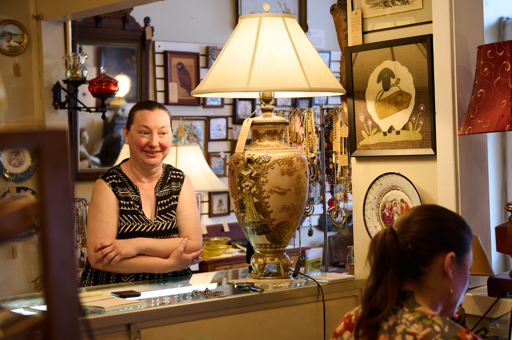
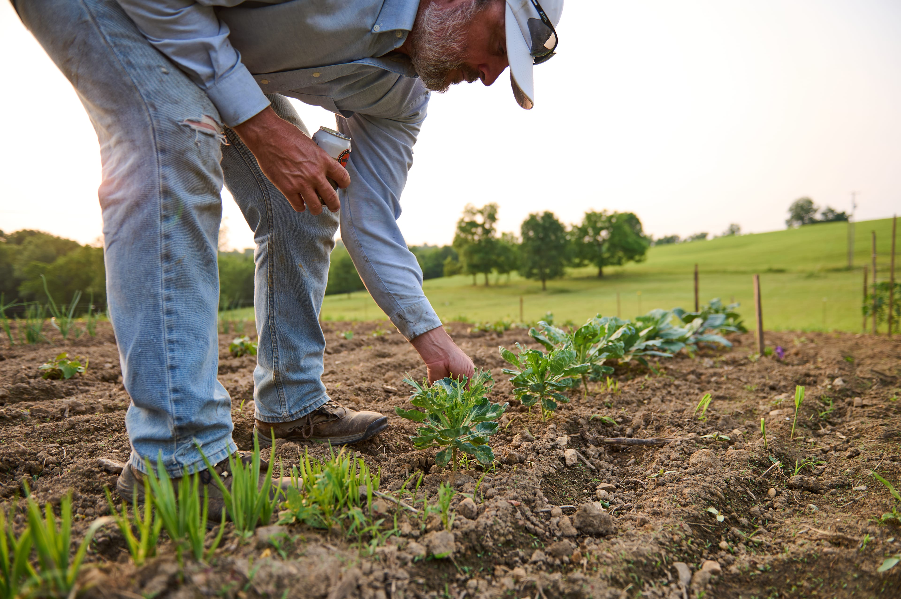
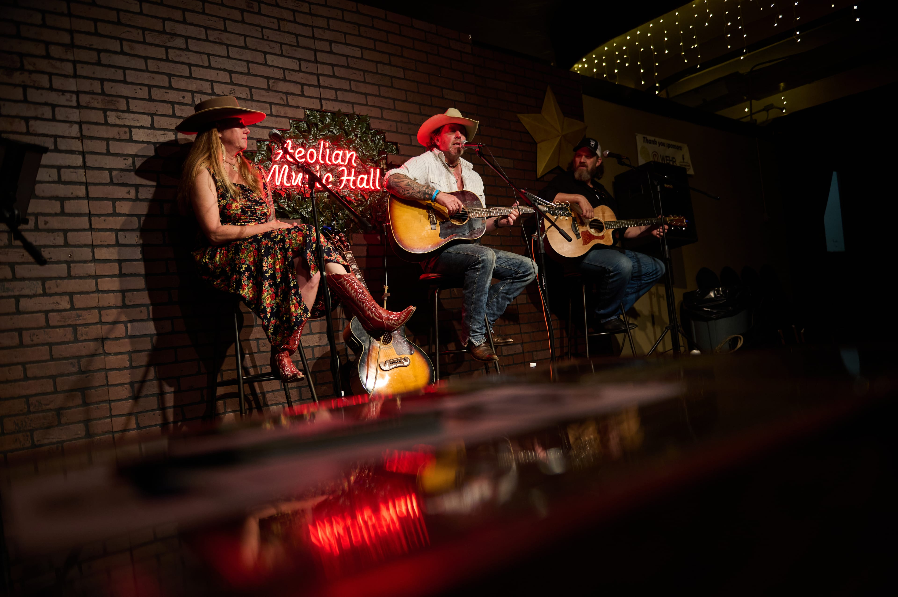

The road into Boyd Station, Ky., narrows past a grain elevator and a cluster of brick storefronts before the land opens into rolling pasture. It is a place that reveals itself slowly. Nothing there strains for your attention.

I arrived on a Monday evening in early June. The last light cut long across a wildflower meadow on the edge of town, white and pink blossoms thick in the foreground, the hills going soft green behind them. Two men were already down by the water, one threading a fly line with the focused quiet of long habit.

By nightfall the kids on the property had found sparklers. A boy in a blue t-shirt swung one in a wide arc, smoke drifting into the dark around him, the moon faint above the tree line. An adult stood close enough to steady the moment. Nothing about it felt staged.

The next morning I walked the main strip. One shop window read, in clean white block letters: A BEAUTIFUL PLACE TO BE. Inside another, a woman with her arms crossed smiled across a glass case packed with ornate lamps, gilded vases, and framed portraits. Artisan soaps, tea tree, peppermint, sat in damask-wrapped rows near the door.

Down the block, a turquoise vintage truck sat half-dissected at the curb. A man in sunglasses was stretched under the steering column. A woman with wavy blond hair and aviator glasses sat in the passenger seat watching him work. They had been at it for hours, she said. They would be at it for more.

> It's a beautiful place to be - the sign in the window doesn't lie.

On the second afternoon I rode out to a working farm on the edge of town. A man in a gray shirt and white cap moved along a row of vegetable seedlings, crouching to press a stem gently back into the soil. Two ranchers in matching cowboy hats stood at the pasture fence watching cattle graze. No one seemed interested in rushing the day along.

Thursday night the Aeolian Music Hall filled up. The red neon sign above the stage threw everything in warm light. A woman in a floral dress and wide-brimmed tan hat took the left stool. A man in a white shirt and red cowboy hat settled at center with an acoustic guitar. A third musician, bearded, in black, took the right. They played for two hours to a room that didn't want to leave.

I drove out the same road I came in on. The grain elevator was dark. The wildflower meadow had disappeared into the night. Boyd Station had given me three days and asked for nothing in return. That felt true to the place.
